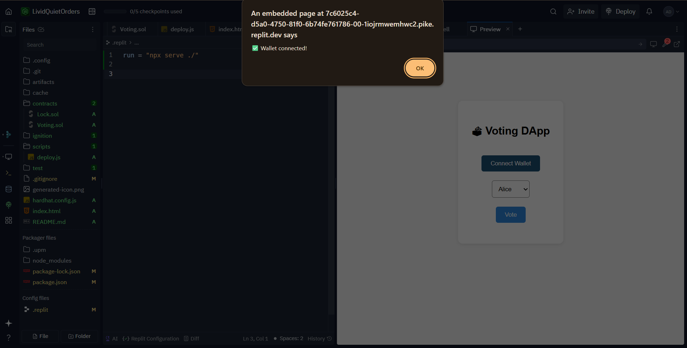

# 🚀 Private Ethereum Blockchain DApp

This is a simple decentralized application (DApp) running on a private Ethereum blockchain using **Hardhat**. The DApp lets users set and retrieve a message stored on the blockchain.

---

## 📸 Interface Preview



---

## 🛠 Features

- Private Ethereum blockchain (localhost)
- Smart contract in Solidity
- Web3-enabled frontend (HTML + JS)
- Ethers.js integration with MetaMask

---

## 📁 Project Structure

```
private-ethereum/
├── contracts/
│   └── MyContract.sol
├── scripts/
│   └── deploy.js
├── frontend/
│   ├── index.html
│   └── app.js
├── hardhat.config.js
└── README.md
```

---

## 🔧 Setup Instructions

### 1. Install Dependencies
```bash
npm install --save-dev hardhat @nomicfoundation/hardhat-toolbox
```

### 2. Initialize Hardhat
```bash
npx hardhat
# Choose: "Create a basic sample project"
```

### 3. Compile Contracts
```bash
npx hardhat compile
```

### 4. Start Local Node
```bash
npx hardhat node
```

### 5. Deploy Smart Contract
In a new terminal:
```bash
npx hardhat run scripts/deploy.js --network localhost
```
Note the contract address and update it in `frontend/app.js`.

---

## 🖥️ Run the Frontend

Open `frontend/index.html` in your browser (enable MetaMask).

You can also serve it using:
```bash
npx serve ./frontend
```

Then visit: `http://localhost:3000`

---

## 🧾 Smart Contract

```solidity
pragma solidity ^0.8.20;

contract MyContract {
    string public message;

    constructor(string memory _msg) {
        message = _msg;
    }

    function setMessage(string memory _msg) public {
        message = _msg;
    }
}
```

---

## 💬 MetaMask Setup

1. Connect to `http://127.0.0.1:8545` (Custom RPC)
2. Use one of the private keys printed by `hardhat node`
3. Approve the connection and interact with the DApp

---

## 📎 Notes

- Contract address must be manually set in `app.js`
- Works only on localhost unless deployed to testnet
- Screenshot is located at `screenshot.png`

---

## ✅ Deliverables

- Smart contract code
- Frontend DApp
- Hardhat configuration
- Screenshot included above

---
